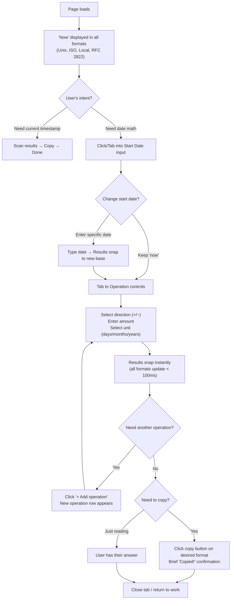
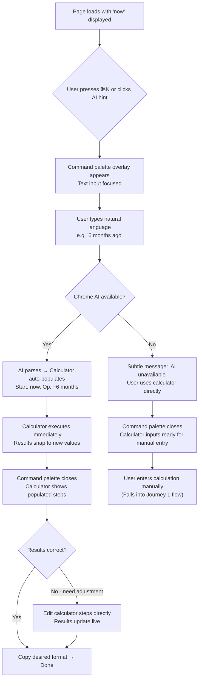
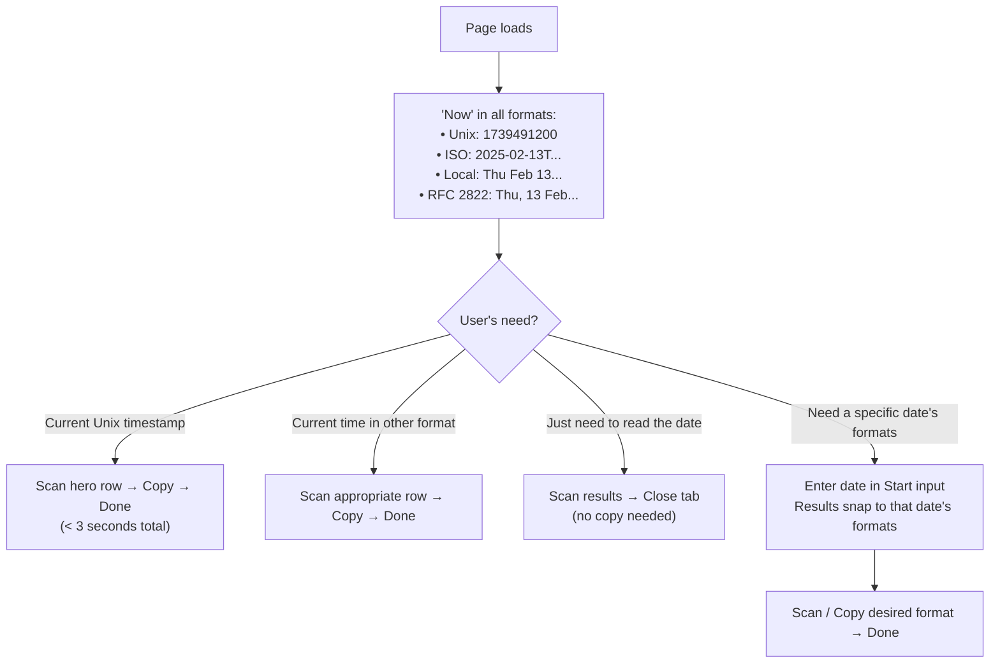
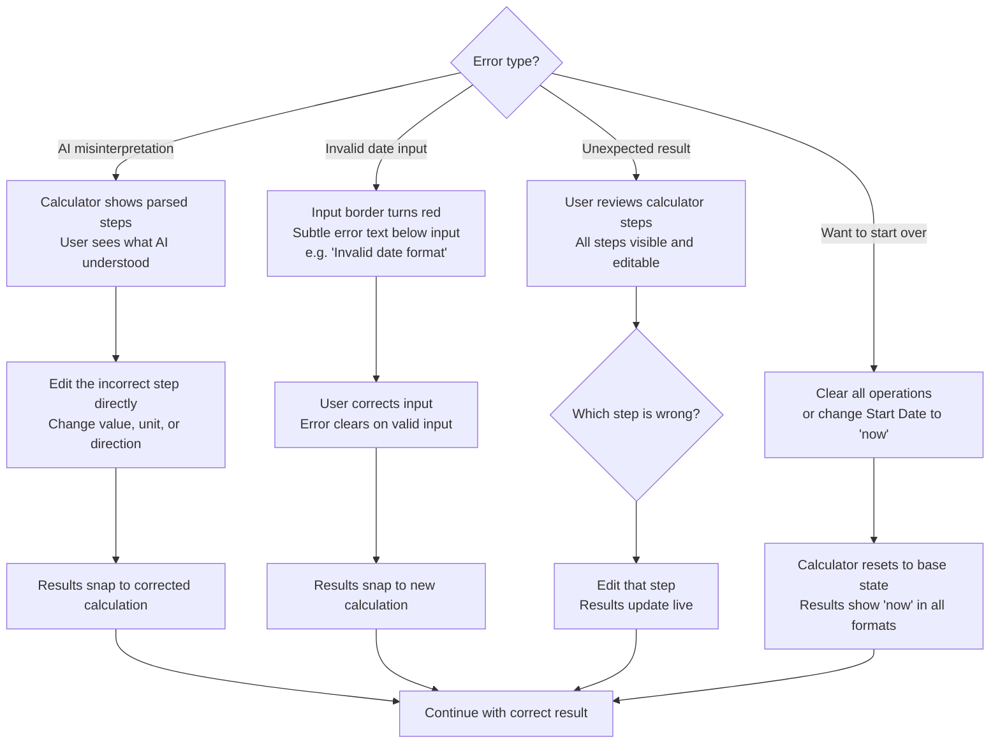

# UX Design Specification: datetime-helper

**Author:** Samuel
**Date:** 2026-02-13

---

<!-- UX design content will be appended sequentially through collaborative workflow steps -->

## Executive Summary

### Project Vision

datetime-helper is a single-page developer utility that combines date math calculation with multi-format output — critically including Unix timestamps — in one frictionless interface. It eliminates the multi-site bounce developers currently endure (epochconverter.com for timestamps, timeanddate.com for date math) by solving both in a single tab. The architecture is calculator-first: a structured date calculator is the source of truth, with Chrome's built-in AI (Gemini Nano) acting as an optional convenience layer that translates natural language into visible, editable calculator steps. Built with Astro + Rust/Wasm (jiff) + Tailwind CSS on Cloudflare Pages — static-first, zero-server, instant-loading.

The north star metric is **page load to copied result in under 5 seconds**.

### Target Users

**Primary: The Timestamp Wrangler** — Backend engineers, DevOps engineers, DBAs, and SREs who work with Unix timestamps daily. They already know what timestamps are; they need speed, not education. They arrive mid-task — debugging database records, writing time-range queries, seeding test data, analyzing logs — with working memory full of something else. They trigger a datetime lookup from all contexts: SQL consoles, log files, unit tests, Slack threads. Almost exclusively desktop browser usage. Their copy habit is double-click + Ctrl+C. They never share datetime results with teammates — the value goes straight into their own work.

**Secondary:** QA engineers (edge case timestamp generation), business stakeholders (natural language date questions), AI agents (URL construction).

### Key Design Challenges

1. **Instant comprehension under cognitive load** — Users arrive mid-task with full working memory. The UI must communicate "type here, get answer" within 1-2 seconds of landing. Any learning curve or visual clutter means they'll just Google another tool.

2. **Two input paradigms, one interface** — The structured calculator and AI natural language input are fundamentally different interaction models on the same page. The calculator must feel primary and self-sufficient; the AI input must feel like an accelerator, not a separate feature.

3. **Multi-format output without visual overwhelm** — Showing Unix, ISO 8601, RFC 2822, and local human-readable simultaneously risks a wall of text. The format the user wants most (usually Unix) needs visual dominance. Values must support the "double-click, Ctrl+C" habit while one-click copy buttons offer a faster path.

### Design Opportunities

1. **The "zero UI" ideal** — No sharing features, no accounts, no settings, no hamburger menu. We can strip the interface to its absolute essence and optimize for one thing: fastest path from intent to clipboard.

2. **Trust through transparency** — AI-parsed operations are displayed as visible, editable calculator steps. Users see exactly what happened. Transparency is the differentiator versus black-box tools.

3. **Copy as the hero interaction** — Since the end goal is always "get a value into my clipboard and return to what I was doing," the entire results area can be designed around making copy the most prominent, frictionless action — large click targets, clear visual feedback, and format prominence hierarchy.

## Core User Experience

### Defining Experience

The core interaction loop is **input → result → done**. Every path through the tool — structured calculator, AI natural language, or simply reading — follows this minimal arc.

**The core user action is: get a datetime value in the format I need, as fast as possible.**

This manifests in two modes:
- **Copy mode** (most common): Enter what I need → see the answer in the format I want → copy it → leave.
- **Read mode**: Enter what I need → see the human-readable datetime or multi-format output → I have my answer → leave. No copy required.

**Default state on page load:** The page arrives pre-filled with "now" — current Unix timestamp, ISO 8601, RFC 2822, and local human-readable time are all visible immediately. Before the user touches anything, the tool is already useful. The simplest use case (current timestamp) requires zero interaction.

**Primary calculator pattern:** Start from "now," subtract or add a duration (e.g., -6 months, +30 days). Starting from a specific date is supported but secondary.

**AI auto-execution:** When Chrome AI parses natural language input, it populates the calculator steps and auto-executes immediately — no confirmation dialog. The steps are visible and editable so the user can verify and adjust, but the default path is instant results.

### Platform Strategy

- **Desktop web browser** — the primary and nearly exclusive platform. Optimized for mouse/keyboard interaction on standard desktop viewports.
- **Mobile** — basic responsiveness (stacked layout) but not a priority design target. Mobile use cases (e.g., checking a PagerDuty alert timestamp on a phone) should work but won't drive design decisions.
- **Offline capability** — inherent from the architecture. Static site + Wasm engine means the tool works without network once cached. No explicit offline mode needed.
- **No platform-specific capabilities required** beyond Chrome's built-in AI (Gemini Nano) for the natural language feature, which degrades gracefully when unavailable.

### Effortless Interactions

- **Page load → value visible** — zero interaction required. "Now" in all formats is there the moment the page renders.
- **Live calculation** — no submit button. Adjusting any operation updates results instantly. Cause and effect are simultaneous.
- **One-click copy** — copy buttons on each format with brief visual confirmation ("Copied!"). Values are also selectable for the double-click + Ctrl+C habit.
- **AI input → auto-execute** — type natural language, results appear. No "confirm interpretation" step in the way.
- **No account, no settings, no onboarding** — the tool is self-evident on first visit. If you have to explain how it works, the design has failed.

### Critical Success Moments

1. **Page load = instant value.** Current timestamps visible before any interaction. First-time visitors immediately see "this is different" — no ads, no forms, just answers.

2. **First calculation completes live.** User adjusts an operation, results update simultaneously. No loading state, no submit. Trust in the tool is established.

3. **First AI parse auto-executes correctly.** User types "6 months ago," calculator populates, results appear — all in one motion. The "aha" moment: "I typed what I needed and got the Unix timestamp in one step."

4. **First copy succeeds.** One click, value in clipboard, brief visual feedback. The completion moment. User closes the tab and returns to their real work.

5. **The "just reading" case.** Multi-format display answers the question without requiring copy. The tool is useful even when the clipboard isn't involved.

**Make-or-break failure:** If the page takes more than ~1 second to become interactive, or if the user has to figure out *how* to use the calculator before they can use it — they leave and Google another tool. The first 2 seconds determine everything.

### Experience Principles

1. **Useful on arrival** — The page shows "now" in all formats the moment it loads. Zero interaction required for the simplest use case.

2. **Input → result → done** — Every path through the tool follows the same minimal arc. No confirmation dialogs, no submit buttons, no multi-step wizards. Live results, always.

3. **Copy is king, but reading counts** — Copy buttons are the hero action with prominent placement and feedback, but the multi-format display is equally designed for scanning.

4. **The calculator is the truth** — AI populates calculator steps and auto-executes, but the calculator is always visible and editable. The user can verify and adjust. No black boxes.

5. **Disappear when done** — The tool exists to get the user back to their real work. No engagement hooks, no "explore more features" prompts, no friction on exit. Speed in, speed out.

## Desired Emotional Response

### Primary Emotional Goals

**Effortless competence** — The dominant feeling is "I knew exactly what to do, I got my answer, I'm back to work." The tool should feel like a sharp knife cutting cleanly — no resistance, no wasted motion. Users should feel *capable and fast*, not impressed by the tool itself.

**Respect for my time** — The differentiating emotion versus competitors. epochconverter.com feels cluttered and ad-heavy. timeanddate.com feels like a reference site, not a tool. datetime-helper should communicate "this was built by someone who gets it" — clean, purposeful, no wasted pixels.

**Alive but not busy** — Subtle animations bring liveliness to what could otherwise feel like a static utility. The page should feel responsive and organic — values updating smoothly, copy feedback animating, transitions that communicate state change — without ever feeling flashy or distracting. The animation serves comprehension and feel, not decoration.

### Emotional Journey Mapping

| Stage | Desired Emotion | Design Implication |
|-------|----------------|-------------------|
| **First discovery** | "This is clean. This might actually be good." | Minimal UI, no ads, no clutter. Instant visual contrast with competitors. |
| **Page load** | "It already has my answer." | Pre-filled "now" in all formats. Useful before any interaction. |
| **Core interaction** | "Effortless competence. This just works." | Live results, no submit buttons, smooth animation on value changes. |
| **AI parse** | "Of course that worked." Expected, not surprising. | Auto-execute with visible steps. No fanfare, just correct results appearing naturally. |
| **Copy** | "Done. Back to work." | Brief, satisfying copy confirmation animation. Then nothing — the tool gets out of the way. |
| **Error/misinterpretation** | "Easy to fix." | Editable calculator steps are right there. Adjust and results update live. No error dialogs, no dead ends. |
| **Return visit** | "Right where I left off mentally." | Same clean interface, same instant value. Familiarity builds speed. |

### Micro-Emotions

**Critical positive states:**
- **Confidence** over confusion — The user always knows what the tool did and why. Transparent calculator steps, clear format labels, no ambiguity.
- **Trust** over skepticism — The calculator is the source of truth, visibly computing the result. No black box. Editable steps mean the user is always in control.
- **Accomplishment** over frustration — The copy action provides a brief, satisfying visual confirmation. Task complete. Move on.

**States to actively avoid:**
- **Overwhelm** — Too many formats, too many options, visual clutter. Fight this with hierarchy and restraint.
- **Uncertainty** — "Did it copy? Did the AI understand me? Is this UTC or local?" Every state must be unambiguous.
- **Impatience** — Any perceptible delay breaks the "effortless" feeling. Sub-100ms response for calculator operations; instant page load.

### Design Implications

- **Confidence → transparent steps** — Every calculation shows its work. The user sees "Start: now, Operation: -6 months" in editable form.
- **Effortless competence → no submit buttons** — Live results update as inputs change. Smooth value transition animations communicate "something changed" without demanding attention.
- **Alive but not busy → purposeful animation** — Value changes animate smoothly (number transitions, fade-ins). Copy confirmation uses a brief, satisfying micro-animation. Page load has a subtle entrance. Nothing loops, nothing bounces, nothing demands attention.
- **Respect for time → visual hierarchy** — Unix timestamp gets the most visual weight. Other formats are clearly present but secondary. The eye goes to the most-needed value first.
- **Easy to fix → editable state** — When AI misinterprets or the user wants to adjust, the calculator steps are right there, already populated, already editable. Changing a step re-computes live. No "start over" flow.

### Emotional Design Principles

1. **Feel fast, not flashy** — Animation serves comprehension and liveliness, never decoration. Every motion communicates a state change or provides feedback.

2. **Confidence through transparency** — Show the work. Show the steps. Show what format this is. Never leave the user guessing.

3. **The tool disappears** — The best emotional outcome is that the user barely remembers using the tool. They got their answer, they're back to work. The tool served its purpose and got out of the way.

4. **Errors are adjustments, not failures** — Wrong AI interpretation? Edit the step. Wrong date? Change the input. Everything is live, everything is recoverable. No error dialogs, no dead ends, no frustration.

## UX Pattern Analysis & Inspiration

### Inspiring Products Analysis

**[crontab.guru](https://crontab.guru/)** — The benchmark for single-purpose developer tools. One text input, live interpretation below, nothing else. The entire tool is visible without scrolling. No pages, no buttons, no onboarding. You type, you see. The UX is the product.

- **Core pattern:** Single input → live result, zero intermediary steps
- **Visual design:** Content is the design. Minimal chrome, maximum information density
- **Onboarding:** None. Assumes domain knowledge. Doesn't explain cron — just interprets it
- **Emotional quality:** Effortless competence. "I typed it, I see it, I'm done."

**[compresspng.com](https://compresspng.com/)** — Client-side WebAssembly processing tool. Drop files, compress, save. Proves that Wasm-powered tools can feel instant and trustworthy. Clear before/after quantification builds confidence in results.

- **Core pattern:** Primary action is the most visually dominant element on the page
- **Feedback:** Immediate, quantified results (before: X KB, after: Y KB, -Z%)
- **Architecture:** Browser-only processing — no uploads, no server dependency. Same trust model as datetime-helper
- **Emotional quality:** "It just worked, and my data never left my machine."

**[epochconverter.com](https://www.epochconverter.com/)** — The incumbent datetime tool. Responsive conversions and a live-updating current timestamp create immediacy. But years of feature accumulation have buried the core value under clutter.

- **What works:** The live-ticking current Unix timestamp at the top is compelling — alive, immediately useful, zero interaction required
- **What breaks:** Multiple tools competing for attention on one page. No visual hierarchy. Ads. No date math capability
- **Lesson:** Responsiveness is table stakes. The gap is focus and date math.

### Transferable UX Patterns

**From crontab.guru:**
- **Single-input dominance** — One primary input controls the entire tool. For datetime-helper: the calculator operation is the single input, AI text input is the accelerator
- **Live interpretation** — Results update as you interact, with zero submit actions. Direct transfer to our live calculation model
- **Visible-without-scrolling** — The entire tool fits in a viewport. Input and output are spatially connected. No scrolling to see your result

**From compresspng.com:**
- **Primary action prominence** — The most important action (COMPRESS / copy) gets the most visual weight. For datetime-helper: copy buttons should be the most visually prominent interactive elements in the results area
- **Quantified feedback** — Show concrete values, not abstract states. For datetime-helper: timestamps and dates, not "processing..." spinners
- **In-browser trust** — "Your files never leave your device" messaging builds trust in client-side Wasm processing. Relevant for our Chrome AI integration

**From epochconverter.com:**
- **Live-ticking current time** — The animated current Unix timestamp creates liveliness and immediate utility. Direct transfer to our "now" default state — but with all formats, not just Unix
- **Responsiveness as baseline** — Instant conversion response is expected, not a feature. Our Wasm engine must match or exceed this

### Anti-Patterns to Avoid

- **Feature clutter (epochconverter)** — Multiple tools on one page with no hierarchy. Everything competes for attention. datetime-helper must resist feature accumulation and maintain single-purpose focus
- **Explaining what the user already knows** — epochconverter fills the page with code examples and educational content. Our primary user already knows what a Unix timestamp is. Don't explain — just compute
- **Ads and visual noise** — Competitors monetize with ads that break focus. datetime-helper is ad-free and should feel like it
- **Hidden primary action** — On epochconverter, the "convert" action competes with dozens of other elements. Our core actions (calculate, copy) must be impossible to miss
- **Separate forms for related operations** — epochconverter uses separate sections for "timestamp to date" and "date to timestamp." datetime-helper unifies these into one calculator flow

### Design Inspiration Strategy

**Adopt directly:**
- crontab.guru's "entire tool in one viewport" philosophy — calculator + results visible without scrolling
- crontab.guru's live-update-as-you-type interaction model — no submit buttons
- epochconverter's live-ticking current timestamp — animated, alive, immediately useful on load
- compresspng.com's primary action prominence — copy buttons as the visually dominant interaction

**Adapt for our context:**
- crontab.guru's single input field → our calculator has multiple inputs (start date, operation, unit), but they should feel like one cohesive interaction, not separate forms
- compresspng.com's before/after quantification → our multi-format output serves a similar "here are the concrete values" role, with visual hierarchy giving Unix timestamp the most weight

**Avoid deliberately:**
- epochconverter's feature accumulation — we ship fewer features, done better
- epochconverter's educational content on the main page — our users don't need a tutorial
- Any layout that requires scrolling to see results after entering input

## Design System Foundation

### Design System Choice

**Tailwind CSS utility-first (custom components)** as the primary approach, with **shadcn/ui** and **DaisyUI** as reference libraries for complex interactive components where accessibility or interaction patterns would be costly to build from scratch.

This is a custom design system built directly on Tailwind CSS utilities. The component count for datetime-helper is small (calculator inputs, operation controls, result display cards, copy buttons, AI text input) — each one is hand-built with Tailwind classes for pixel-level control.

### Rationale for Selection

- **Low component count** — datetime-helper has approximately 5-6 unique component types. A full design system library would add more dependency overhead than value.
- **Maximum visual control** — The "zero UI" philosophy demands precise control over spacing, hierarchy, and animation. No library opinions to override.
- **Minimal bundle size** — Tailwind purges unused classes at build time. No component library JS to ship. Aligns with the < 1 second page load target.
- **Inspiration alignment** — crontab.guru and compresspng.com both use custom, minimal designs. The tool's visual identity comes from restraint, not from a design system's aesthetic.
- **Solo developer** — No team coordination needed for component consistency. Samuel owns the design language end-to-end.

### Implementation Approach

**Primary: Custom Tailwind components**
- All components built with Tailwind utility classes directly in Astro components
- Design tokens defined as Tailwind theme extensions (colors, spacing, typography, animation timings)
- Dark/light mode via Tailwind's `dark:` variant, following system preference
- Responsive breakpoints for basic mobile support (stacked layout on small screens)

**Fallback: shadcn/ui and DaisyUI for complex components**
- If a component requires non-trivial accessibility patterns (e.g., accessible dropdowns, combobox for unit selection, ARIA-compliant interactive elements), reference shadcn/ui or DaisyUI implementations rather than building from scratch
- shadcn/ui preferred for copy-paste components that become owned code (no runtime dependency)
- DaisyUI considered for semantic class shortcuts if the Tailwind utility verbosity becomes unwieldy in templates

**Decision criteria for when to use a library component:**
- Requires ARIA roles, keyboard navigation patterns, or focus management beyond basic inputs
- Would take more than 2 hours to build accessibly from scratch
- Has well-known interaction edge cases (e.g., dropdown positioning, click-outside-to-close)

### Customization Strategy

**Design tokens (Tailwind theme config):**
- Color palette: Minimal — a primary accent color, neutral grays, success green (for copy confirmation), and semantic colors for format labels
- Typography: Monospace for timestamp/date values (the user will be copying these — monospace aids readability and selection). Sans-serif for labels and UI text
- Spacing: Tight but breathable — the tool should feel dense like a developer tool, not airy like a marketing site
- Animation: Tailwind transition utilities for micro-interactions (value updates, copy feedback, hover states). Custom keyframes for the live-ticking timestamp
- Border radius: Minimal — subtle rounding, not pill-shaped. Developer tool aesthetic
- Shadows: Subtle or none — flat design with hierarchy achieved through spacing and typography weight, not depth

**Component patterns:**
- Calculator inputs: Custom-styled native inputs for maximum performance and accessibility
- Copy buttons: Custom with Tailwind transitions for hover/active/copied states
- Result cards: Custom layout with clear format label + monospace value + copy button per row
- AI input: Custom text input styled as a command palette overlay (Cmd+K pattern from brainstorming)

## Defining User Experience

### Defining Experience

**"Adjust, see every format update instantly."**

The core interaction that defines datetime-helper is the live calculation response. The user changes an input — start date, operation, unit — and all output formats snap to the new values simultaneously. No submit button, no loading state, no animation delay. The results are just *there*.

This is the interaction that:
- Builds trust on first use ("this is responsive and reliable")
- Creates the habit loop ("I adjust, I see, I copy, I leave")
- Differentiates from competitors (epochconverter requires separate form submissions; timeanddate.com requires page reloads)

**The defining experience in one sentence:** "I changed something, and the answer was already there — in every format."

### User Mental Model

**How users currently solve this:**
1. Open epochconverter.com → paste or type a timestamp → read the converted date
2. If they need date math: open timeanddate.com in a second tab → fill in the date calculator form → read the result → go back to epochconverter → convert the result to Unix timestamp
3. Copy the value they need → close tabs → return to their actual work

**Mental model they bring:** Users think in terms of "I need [this date] in [this format]." The operation is a single thought — "6 months ago as a Unix timestamp" — that currently requires 2-3 tools and multiple steps to execute.

**datetime-helper aligns to their mental model** by collapsing those steps: one input surface, one result surface, one copy action. The tool matches how they *think* about the problem, not how existing tools *structure* the solution.

**Where confusion could occur:**
- Calculator operations vs. AI input — which do I use? (Resolved: calculator is visible and primary; AI is invoked via Cmd+K or dedicated input area)
- "Is this UTC or local?" (Resolved: every format label explicitly states its timezone)
- "Did my change take effect?" (Resolved: snap updates make cause-and-effect instantaneous and unambiguous)

### Success Criteria

The defining experience succeeds when:

1. **Instant response** — Calculator operations produce results in < 100ms. The user never perceives a delay between input and output.
2. **Snap updates** — Values change instantly with no transition animation. Speed communicates reliability. The tool respects the user's time by never making them wait for aesthetics.
3. **All formats simultaneously** — Every output format updates at once. The user never needs to "refresh" or "recalculate" for a different format.
4. **Unambiguous state** — At any moment, the user can look at the results and know exactly what they're seeing: what date, what timezone, what format. No stale values, no loading indicators, no ambiguity.
5. **One-copy exit** — From the moment results appear, the user is one click away from having the value in their clipboard and being done.

### Novel UX Patterns

**Pattern classification: Established patterns, combined in a novel way.**

datetime-helper doesn't invent new interaction paradigms. Every individual pattern is proven:
- Live-updating results (spreadsheets, crontab.guru)
- One-click copy buttons (GitHub, code editors)
- Date/time calculators (timeanddate.com)
- Multi-format output (unit converters)
- Command palette / Cmd+K (Raycast, VS Code, Slack)

**The novelty is the combination:** No existing tool puts live date math + multi-format output (including Unix) + one-click copy + AI natural language in a single, scroll-free interface. The innovation is in the *integration*, not in any single component.

**User education needed: None.** Every component uses patterns developers already know. The calculator looks like a calculator. The copy button looks like a copy button. The command palette works like every other Cmd+K. Zero onboarding required.

### Experience Mechanics

**1. Initiation — Page Load:**
- Page loads with "now" as the default start date
- All output formats display the current datetime immediately (Unix, ISO 8601, local human-readable, RFC 2822)
- The live-ticking Unix timestamp creates liveliness — the page feels alive on arrival
- Calculator is visible with default state: Start = now, no operations applied
- The user is already looking at a useful result before they touch anything

**2. Interaction — Calculator Operation:**
- User modifies the start date, or adds an operation (+/- N days/months/years), or changes a unit
- Input controls are native HTML inputs styled with Tailwind — fast, accessible, keyboard-navigable
- Every change triggers an immediate Wasm computation via the jiff engine

**3. Feedback — Snap Results:**
- All output format values snap to new values instantly (< 100ms)
- No transition animations on value changes — instant replacement communicates speed and reliability
- Format labels remain static; only values change — visual stability aids scanning
- The Unix timestamp is visually dominant (larger font, top position)
- Each format row: `[Format Label]  [Monospace Value]  [Copy Button]`

**4. Completion — Copy and Exit:**
- User clicks the copy button on their desired format
- Brief, satisfying micro-animation on the copy button only (e.g., checkmark appears, button text changes to "Copied!" for ~1.5 seconds)
- The value is in the clipboard
- User closes the tab or navigates away — the tool is done

**AI Accelerator Path (when available):**
- User presses Cmd+K (or clicks the AI input area)
- Types natural language: "6 months ago"
- Chrome AI parses → calculator auto-populates with Start: now, Operation: -6 months
- Calculator executes immediately → results snap to new values
- User copies → done
- The AI path merges into the same calculator → results → copy flow at step 2

## Visual Design Foundation

### Color System

**Palette direction:** Light and minimal with warm orange accent.

**Background & Surface:**
- `background`: White (`#FFFFFF`) — primary page background
- `surface`: Light gray (`~#F8F9FA` / Tailwind `gray-50`) — card backgrounds, calculator area, result panels
- `surface-elevated`: Slightly darker gray (`~#F1F3F5` / Tailwind `gray-100`) — hover states, active input areas
- `border`: Subtle gray (`~#E5E7EB` / Tailwind `gray-200`) — dividers, input borders

**Text:**
- `text-primary`: Near-black (`~#1A1A1A` / Tailwind `gray-900`) — headings, primary labels
- `text-secondary`: Medium gray (`~#6B7280` / Tailwind `gray-500`) — format labels, secondary info
- `text-value`: Dark (`~#111827` / Tailwind `gray-900`) — monospace timestamp/date values (high contrast for readability and selection)

**Accent (Orange):**
- `accent`: Warm orange (`~#F97316` / Tailwind `orange-500`) — primary interactive elements, active states, focus rings
- `accent-hover`: Deeper orange (`~#EA580C` / Tailwind `orange-600`) — hover states on interactive elements
- `accent-light`: Soft orange tint (`~#FFF7ED` / Tailwind `orange-50`) — subtle highlights, active input backgrounds
- `accent-muted`: Muted orange (`~#FDBA74` / Tailwind `orange-300`) — less prominent accents, secondary indicators

**Semantic:**
- `success`: Green (`~#22C55E` / Tailwind `green-500`) — copy confirmation ("Copied!" state)
- `error`: Red (`~#EF4444` / Tailwind `red-500`) — input validation errors (rare — mostly for malformed date input)

**Dark mode (system preference toggle):**
- Background inverts to dark slate (`~#0F172A` / Tailwind `slate-900`)
- Surface to darker slate (`~#1E293B` / Tailwind `slate-800`)
- Text inverts to light grays
- Orange accent remains consistent across both modes — the brand color stays warm
- Ensure all text/background combinations meet WCAG AA contrast ratios (4.5:1 minimum)

### Typography System

**Typeface strategy: Dual-family system.**

**Monospace (values):** `JetBrains Mono`, `Fira Code`, or `Source Code Pro` (fallback: `ui-monospace, monospace`)
- Used for: all timestamp values, date strings, calculator inputs
- Rationale: developers are trained to read monospace. It signals "this is a copyable value." Consistent character widths prevent layout shift when values change.

**Sans-serif (UI):** `Inter`, `system-ui`, or `-apple-system` (system font stack)
- Used for: format labels, UI controls, button text, page title
- Rationale: clean, neutral, high readability at small sizes. System fonts load instantly (zero FOIT/FOUT).

**Type scale:**

| Element | Size | Weight | Family |
|---------|------|--------|--------|
| Unix timestamp (hero) | 2rem / 32px | 600 (semibold) | Monospace |
| Other format values | 1.125rem / 18px | 400 (regular) | Monospace |
| Format labels | 0.75rem / 12px | 500 (medium) | Sans-serif |
| Calculator input values | 1rem / 16px | 400 (regular) | Monospace |
| UI labels / button text | 0.875rem / 14px | 500 (medium) | Sans-serif |
| Page title / branding | 1.25rem / 20px | 600 (semibold) | Sans-serif |

**Line heights:** 1.5 for UI text, 1.2 for monospace values (tighter — values don't need reading line-height).

### Spacing & Layout Foundation

**Base unit:** 4px (Tailwind default). All spacing derived from multiples of 4.

**Density:** Tight but breathable — developer tool density, not marketing site airiness.

| Spacing token | Value | Usage |
|--------------|-------|-------|
| `xs` | 4px (1) | Inline gaps, icon-to-text spacing |
| `sm` | 8px (2) | Between related elements (label to value, icon to text) |
| `md` | 16px (3-4) | Between components (format row to format row) |
| `lg` | 24px (6) | Between sections (calculator area to results area) |
| `xl` | 32px (8) | Page-level padding, major section gaps |

**Layout structure:**
- Single viewport, no scroll — entire tool visible on a standard desktop (1280x800+)
- Two-zone layout: **Input zone** (left/top) and **Output zone** (right/bottom)
  - Desktop (>= 768px): Side-by-side, roughly 40/60 split (calculator narrower, results wider since they contain more content)
  - Mobile (< 768px): Stacked vertically, input on top, results below
- No grid system needed — flexbox layout with fixed spacing. The component count is too low to warrant a grid.
- Maximum content width: ~960px centered, with generous horizontal padding. The tool shouldn't stretch across a 27" monitor.

**Border radius:** 6px (`rounded-md` in Tailwind) — subtle rounding, not pill-shaped. Consistent across all elements (inputs, buttons, cards).

**Shadows:** None on most elements. Optional very subtle shadow on the result cards to create minimal depth separation from background (`shadow-sm` in Tailwind). Flat aesthetic achieved primarily through background color differentiation, not elevation.

### Accessibility Considerations

- **Contrast ratios:** All text/background combinations must meet WCAG AA (4.5:1 for normal text, 3:1 for large text). The orange accent on white must be tested — pure orange on white can fail contrast. Use `orange-600` or darker for text-on-white; `orange-500` is safe for large text and non-text elements (buttons, borders, focus rings).
- **Focus indicators:** Visible orange focus ring (2px solid) on all interactive elements. Never remove default focus styles without replacement.
- **Monospace value selection:** Values must be selectable via double-click for the "double-click + Ctrl+C" copy habit. No `user-select: none` on any value text.
- **Reduced motion:** Respect `prefers-reduced-motion` media query. When active, disable the live-ticking timestamp animation and any copy button micro-animations.
- **Keyboard navigation:** All interactive elements reachable via Tab. Logical tab order: calculator inputs → operation controls → result copy buttons.
- **Color not sole indicator:** Don't rely on orange alone to communicate state. Copy confirmation uses both color (green) and text change ("Copied!") and icon change (checkmark).

## Design Direction Decision

### Design Directions Explored

Six visual directions were generated and evaluated as interactive HTML mockups (`ux-design-directions.html`):

1. **Classic Side-by-Side** — 40/60 split, calculator left, results right
2. **Stacked Compact** — Single column, crontab.guru-inspired
3. **Card Grid** — Modular cards on gray canvas, hero timestamp full-width
4. **Terminal Aesthetic** — Dark, CLI-inspired with prompt-style input
5. **Minimal Zen** — Centered, ultra-minimal, giant hero timestamp
6. **Dense Dashboard** — Compact panels, 2-column format grid

### Chosen Direction

**Direction 1: Classic Side-by-Side**

A 40/60 split layout with the calculator in the left input zone and multi-format results in the right output zone. The zones are separated by a subtle border, with the input zone on a slightly different background (`gray-50`) to visually distinguish "where I act" from "where I read."

**Key layout elements:**
- **Header:** Minimal — logo left, Cmd+K AI hint right
- **Left zone (40%):** Start date input, operation controls (+/- N units), "Add operation" button, Cmd+K natural language hint
- **Right zone (60%):** Hero Unix timestamp row (orange-tinted background, large monospace value, prominent copy button), followed by ISO 8601, Local Time, and RFC 2822 rows — each with format label, monospace value, and copy button
- **No footer, no navigation, no sidebar** — single-viewport, no scroll

### Design Rationale

- **Matches the brainstorming vision** — The side-by-side layout was identified in brainstorming as the target (idea #19). Choosing it maintains consistency across planning artifacts.
- **Clear input/output mental model** — Left = "what I'm doing," right = "what I'm getting." The spatial separation maps directly to the user's mental model of cause and effect.
- **Room for the calculator** — The 40% input zone gives enough space for start date, operation controls, and future extensibility (additional operations, snap-to buttons) without feeling cramped.
- **Hero timestamp prominence** — The 60% output zone provides generous space for the Unix timestamp to dominate visually at 28-32px monospace, with the orange-tinted hero row drawing the eye immediately.
- **Copy button accessibility** — Each result row has its own copy button at the right edge, aligned consistently. The hero row's copy button is larger/more prominent.
- **Fits in one viewport** — At standard desktop resolution (1280x800+), the entire tool is visible without scrolling. Max content width of ~960px keeps it centered and readable.

### Implementation Approach

- Flexbox layout with `width: 40%` / `width: 60%` split
- Input zone: `background: gray-50`, right border `gray-200`
- Output zone: `background: white`
- Hero result row: `background: orange-50`, border `orange-200`
- Standard result rows: `background: gray-50`, border `gray-100`
- Mobile breakpoint (< 768px): Stack vertically, input zone on top, output zone below
- Max container width: `960px`, centered with `margin: 0 auto`
- Reference mockup: `ux-design-directions.html` Direction 1

## User Journey Flows

### Journey 1: Calculator Path (Primary)

**Trigger:** Developer needs a specific datetime calculation — "What's the Unix timestamp for 6 months ago?" or "What date is 30 days from March 1st?"

**Entry point:** Page load (direct navigation, bookmark, or Google search)

**Step-by-step interaction:**

| Step | User Action | System Response | Feedback |
|------|------------|-----------------|----------|
| 1 | Lands on page | Page renders with "now" in all formats | Live-ticking Unix timestamp, all formats visible |
| 2 | Clicks Start Date input | Input receives focus | Orange focus ring |
| 3 | Types or modifies start date | Results snap to new base date | All format values update instantly |
| 4 | Tabs to operation controls | Direction selector (+/−) receives focus | Orange focus ring |
| 5 | Selects direction, enters amount, selects unit | Results snap to calculated date | All format values update instantly |
| 6 | (Optional) Clicks "+ Add operation" | New operation row appears | Smooth insertion |
| 7 | Clicks copy button on desired format | Value copied to clipboard | Button shows checkmark + "Copied!" for 1.5s |
| 8 | Closes tab | — | — |

**Time to value:** 3-5 seconds (page load → copy)

### Journey 2: AI Natural Language Path

**Trigger:** Developer knows what they want in plain language — "6 months ago" or "start of next quarter"

**Entry point:** Cmd+K shortcut or clicking the AI input hint in the header

**Key design decisions:**
- Command palette is a floating overlay (not a page navigation), dismissible with Escape
- AI parsing + calculator population + execution happens in one seamless motion — no "confirm interpretation?" step
- On AI unavailability: subtle inline message, no modal/dialog. The calculator is right there as the fallback.
- Parsed steps are visible in the calculator — user can verify and edit

**AI unavailability handling:**
- First time: small informational note explaining Chrome AI requirement
- Subsequent visits: no note, calculator is simply the primary input
- No broken state, no error screen — the calculator works independently

### Journey 3: Quick Lookup

**Trigger:** Developer just needs the current timestamp, or wants to quickly see what a specific date looks like in different formats

**Entry point:** Page load

**This is the zero-interaction journey.** The page is useful the moment it loads. The live-ticking Unix timestamp in the hero row means the most common quick lookup ("what's the current Unix timestamp?") requires zero interaction — just read and copy.

### Journey 4: Error Recovery

**Trigger:** AI misinterprets input, user enters an invalid date, or calculation produces an unexpected result

**Error recovery principles:**
- **No modal error dialogs** — errors are inline, contextual, and non-blocking
- **No dead ends** — every error state has an obvious path forward (edit the step, correct the input, clear and restart)
- **Live recovery** — fixing the error immediately produces correct results. No "retry" button needed.
- **Validation is real-time** — invalid input shows error immediately, clears immediately when corrected

### Journey Patterns

**Common patterns across all journeys:**

**Entry pattern: Instant Value**
- Every journey starts with the page already showing useful data ("now" in all formats)
- No loading screen, no empty state, no "click here to begin"

**Interaction pattern: Direct Manipulation → Snap Results**
- Every input change produces immediate output
- No submit buttons, no "calculate" actions
- Results snap (no animation delay on values)

**Exit pattern: Copy and Leave**
- The terminal action is always copy (or just reading)
- Brief "Copied!" feedback (1.5s), then the tool is quiet
- No "what's next?" prompts, no engagement hooks

**Fallback pattern: Graceful Degradation**
- AI unavailable → calculator works standalone
- Invalid input → inline error, immediate recovery on correction
- Misinterpretation → editable steps, live correction

### Flow Optimization Principles

1. **Minimize steps to clipboard** — Every journey is optimized for the fewest possible interactions between page load and copied result. The quick lookup achieves it in 1 step (copy). The calculator path achieves it in 3-4 steps.

2. **No confirmation barriers** — No "are you sure?" dialogs. No "confirm interpretation?" pauses. Every action is immediately reversible, so confirmation gates are unnecessary friction.

3. **Progressive complexity** — The simplest journeys (quick lookup, current timestamp) require zero interaction. More complex journeys (date math, AI input) require proportionally more interaction. The tool never forces complexity on simple tasks.

4. **Parallel paths, same destination** — Calculator path, AI path, and quick lookup all converge on the same result display. The input mechanism varies; the output experience is identical. This means one result UI to maintain and one copy interaction to learn.

## Component Strategy

### Design System Components

**From Tailwind CSS (used directly):**
- Native `<input>` elements styled with Tailwind utilities — for start date and operation amount
- Native `<select>` elements styled with Tailwind — for direction (+/−) and unit (days/months/years)
- Tailwind transition utilities — for copy button state changes and hover effects
- Tailwind `dark:` variants — for system-preference dark mode

**From shadcn/ui or DaisyUI (if needed):**
- No components identified as requiring library fallback at this time. All 8 components are simple enough to build custom. If accessibility testing reveals issues with native selects, shadcn/ui's Select component would be the fallback.

### Custom Components

#### 1. StartDateInput

**Purpose:** Text input for the base date of the calculation. Defaults to "now" (live-ticking).
**Usage:** Always visible in the left input zone. First interactive element in the calculator.
**Anatomy:** `[Input field]` with placeholder/default "now" in orange text
**States:**
- `default`: Shows "now" in orange text, live-updating
- `focused`: Orange focus ring (2px), ready for text input
- `editing`: User has typed a custom date, text becomes dark gray
- `error`: Red border, subtle error message below (e.g., "Invalid date format")
- `reset`: Returns to "now" when cleared or after reset button press
**Accessibility:** `aria-label="Start date"`, accepts flexible date formats (ISO, natural date strings)
**Interaction:** On focus, select all text for easy replacement. On blur with empty value, revert to "now."

#### 2. OperationRow

**Purpose:** A single date math operation: direction + amount + unit. Chainable — multiple rows for multi-step calculations.
**Usage:** Appears below StartDateInput. At least one visible by default. Additional rows added via AddOperationButton.
**Anatomy:** `[Direction select (+/−)] [Amount input] [Unit select (days/months/years)] [Remove button ✕]`
**States:**
- `default`: All fields at default values (subtract, 0, days)
- `active`: One field focused, orange focus ring
- `populated`: User has entered values, results updating live
- `single`: When it's the only operation row, remove button is hidden
**Variants:** No size variants. All rows identical.
**Accessibility:** Logical tab order: direction → amount → unit → remove. Arrow keys on selects. `aria-label` on remove button: "Remove operation."
**Interaction:** Any field change triggers immediate Wasm recalculation. Remove button removes the row and recalculates.

#### 3. AddOperationButton

**Purpose:** Adds a new OperationRow to the calculator for multi-step calculations.
**Usage:** Always visible below the last OperationRow.
**Anatomy:** `[+ Add operation]` — full-width dashed-border button
**States:**
- `default`: Dashed gray border, gray text
- `hover`: Border becomes orange-tinted, text darkens
- `active`: Brief press feedback
**Accessibility:** `aria-label="Add another operation step"`
**Interaction:** Click adds a new OperationRow below. New row receives focus on the direction select.

#### 4. ResetButton

**Purpose:** Clears all operations and returns the calculator to its default state: Start = "now", no operations.
**Usage:** Visible in the input zone when the calculator has been modified from default state.
**Anatomy:** `[↺ Reset]` — compact button, subtle styling
**States:**
- `hidden`: Calculator is at default state — button not visible
- `default`: Small, subtle gray button — present but not visually dominant
- `hover`: Text and icon become orange
- `active`: Brief press feedback
**Accessibility:** `aria-label="Reset calculator to current time"`
**Interaction:** Click clears all operations, resets start date to "now," results snap back to current datetime. Instant — no confirmation dialog.

#### 5. ResultRow

**Purpose:** Displays a single datetime format with its value and a copy button.
**Usage:** One row per format (ISO 8601, Local Time, RFC 2822) in the right output zone.
**Anatomy:** `[Format Label]  [Monospace Value]  [CopyButton]`
**States:**
- `default`: Gray-50 background, gray-100 border
- `updated`: Value has just changed (snap — no animation on the value itself)
**Accessibility:** Value text is selectable (double-click + Ctrl+C supported). Format label uses `aria-label` for screen readers.
**Interaction:** Value is read-only but selectable. Copy action is via the CopyButton.

#### 6. HeroResultRow

**Purpose:** Displays the Unix timestamp — the most important output format — with maximum visual prominence.
**Usage:** First row in the output zone. Always visible.
**Anatomy:** `[Format Label "Unix Timestamp"]  [Large Monospace Value]  [CopyButton]`
**States:**
- `default`: Orange-50 background, orange-200 border. Value at 28-32px semibold monospace.
- `live-ticking`: When start date is "now" and no operations, the Unix timestamp updates every second.
- `static`: When a calculation is applied, timestamp is static (no ticking).
**Accessibility:** `aria-live="polite"` when live-ticking so screen readers announce updates periodically.
**Interaction:** Selectable value + CopyButton.

#### 7. CopyButton

**Purpose:** Copies the adjacent format value to the clipboard.
**Usage:** Appears in every ResultRow and HeroResultRow, right-aligned.
**Anatomy:** `[Copy icon] [Label "Copy"]` → transitions to `[Checkmark icon] [Label "Copied!"]`
**States:**
- `default`: Gray border, gray text/icon, white background
- `hover`: Orange border, orange text/icon, orange-50 background
- `copied`: Green border, green text/icon, green-50 background. Checkmark icon. "Copied!" label. Reverts after 1.5s.
- `focus`: Orange focus ring (keyboard navigation)
**Variants:** Standard size for ResultRow, slightly larger for HeroResultRow
**Accessibility:** `aria-label="Copy [format name] value"`. On copy, `aria-live="assertive"` announces "Copied to clipboard."
**Interaction:** Click → copy to clipboard → `copied` state for 1.5s → return to `default`.

#### 8. CommandPalette

**Purpose:** Floating overlay for AI natural language input. Invoked via Cmd+K.
**Usage:** Appears on demand over the main UI. Not visible by default.
**Anatomy:** `[Backdrop overlay] [Floating panel: [Text input] [Hint text]]`
**States:**
- `hidden`: Not rendered. Default state.
- `open`: Backdrop dims the page. Floating panel centered, text input focused. Hint: "Describe what you need... e.g., '6 months ago'"
- `processing`: Subtle loading indicator while Chrome AI parses (< 1 second typical)
- `unavailable`: If Chrome AI not available, shows subtle message. Auto-dismisses after 2s or on keypress.
**Accessibility:** Focus trapped inside panel when open. Escape closes. `aria-role="dialog"`, `aria-label="Natural language date input"`.
**Interaction:** Cmd+K opens → type → Enter submits → AI parses → calculator populates → palette closes → results snap.

### Component Implementation Strategy

**All components built as Astro components** with Tailwind utility classes. No external component library dependency for MVP.

**Shared patterns:**
- All inputs use native HTML elements for maximum accessibility and performance
- Orange focus rings (`ring-2 ring-orange-400`) on all interactive elements
- Consistent border radius (`rounded-md` / 6px) across all components
- Monospace font family for all value displays
- Sans-serif font family for all labels and UI text

**State management:**
- Calculator state (start date, operations) drives the Wasm engine
- Wasm engine output feeds all ResultRows simultaneously
- No intermediate state — every input change triggers a full recalculation
- CopyButton manages its own copied/default state via local timer

### Implementation Roadmap

**Phase 1 — MVP Core (all required for launch):**

| Priority | Component | Rationale |
|----------|-----------|-----------|
| 1 | HeroResultRow | First thing users see — "now" as Unix timestamp |
| 2 | ResultRow (×3) | ISO, Local, RFC 2822 — complete output surface |
| 3 | CopyButton | The hero interaction — copy to clipboard |
| 4 | StartDateInput | Entry point for all calculator operations |
| 5 | OperationRow | Core date math interaction |
| 6 | AddOperationButton | Multi-step calculations |
| 7 | ResetButton | Clean "start over" action |

**Phase 2 — AI Layer:**

| Priority | Component | Rationale |
|----------|-----------|-----------|
| 8 | CommandPalette | Cmd+K AI natural language input — ships when Chrome AI integration is ready |

## UX Consistency Patterns

### Button Hierarchy

**Three button tiers in datetime-helper:**

| Tier | Button | Style | Rationale |
|------|--------|-------|-----------|
| **Primary action** | CopyButton (all instances) | Outlined gray, orange on hover, green on copied | The most important interactive element. Identical across all result rows — the hero row's background creates hierarchy, not the button itself. |
| **Secondary action** | AddOperationButton | Dashed gray border, full-width | Invites interaction without competing with copy. Dashed border signals "optional, expandable." |
| **Tertiary action** | ResetButton | Plain text with subtle icon, gray | Least visually prominent. Only appears when calculator is modified. Should never distract from the primary copy flow. |

**Button consistency rules:**
- All buttons use `rounded-md` (6px) border radius
- All buttons have orange focus rings for keyboard navigation
- No filled/solid background buttons in the default state — everything is outlined or text-only. This keeps the UI flat and non-competing.
- The only filled background appears transiently: CopyButton's `copied` state (green-50 background, 1.5s)

### Feedback Patterns

**Copy confirmation:**
- **Trigger:** User clicks any CopyButton
- **Visual:** Button transitions: gray outline → green outline + green-50 background + checkmark icon + "Copied!" text
- **Duration:** 1.5 seconds, then reverts to default
- **No toast notifications** — feedback is inline, co-located with the action. No floating elements.

**Input validation errors:**
- **Trigger:** User enters an invalid date in StartDateInput
- **Visual:** Input border turns red (`red-500`). Subtle error text appears below in red, 12px (e.g., "Invalid date format").
- **Recovery:** Error clears instantly when input becomes valid. No "dismiss" action needed.
- **No blocking** — error is informational. The user can continue typing. Results show last valid calculation.

**Live-ticking indicator:**
- **Trigger:** Calculator is at default state (start = "now", no operations)
- **Visual:** Unix timestamp value updates every second. A small "● live" indicator in orange near the hero row communicates that the value is live-updating.
- **Stops when:** Any operation is added or start date is changed from "now." Indicator disappears. Values become static.

**AI processing feedback:**
- **Trigger:** User submits text in CommandPalette
- **Visual:** Subtle inline loading indicator (small spinner or pulsing dot) in the command palette input field
- **Duration:** Typically < 1 second. If > 2 seconds, no additional messaging — the spinner communicates "working."
- **No full-page loading state** — the main UI remains visible and interactive behind the command palette backdrop.

### Input Patterns

**Focus behavior:**
- All inputs show orange focus ring (`ring-2 ring-orange-400`) on focus
- StartDateInput: on focus, select all text for easy replacement
- OperationRow amount input: on focus, select all text
- Tab order follows left-to-right, top-to-bottom within each zone: StartDate → Operation1 direction → Operation1 amount → Operation1 unit → Operation1 remove → Operation2... → AddOperation → Reset

**Default values:**
- StartDateInput defaults to "now" (displayed in orange to indicate it's a live value, not a typed string)
- OperationRow defaults to: subtract (−), 0, days
- On reset: all values return to defaults

**Validation:**
- Real-time validation as the user types — no "validate on submit"
- Invalid states are non-blocking: show the error, let the user keep typing
- Valid input immediately triggers recalculation and clears any error state

**Number input behavior:**
- OperationRow amount field accepts only non-negative integers
- Arrow keys increment/decrement the value
- Direct typing replaces the current value

### Overlay Pattern

**CommandPalette is the only overlay in the application.**

**Behavior rules:**
- Opens via Cmd+K keyboard shortcut or clicking the AI hint in the header
- Semi-transparent backdrop dims the main UI (not fully opaque — the calculator and results remain partially visible for context)
- Floating panel centered horizontally, positioned in upper third of viewport
- Focus is trapped inside the panel — Tab cycles between input and any internal elements
- Escape closes without action
- Enter submits the current text
- Clicking the backdrop closes without action

**Z-index:** CommandPalette is the highest z-index element. No other overlays exist to conflict.

**No other modals, popovers, or overlays exist in the application.** Errors are inline. Confirmations are inline. This simplicity is deliberate.

### Additional Patterns

**Hover states:**
- All interactive elements have a visible hover state change (border color or text color shift toward orange)
- Non-interactive text and labels have no hover effect
- Hover transitions use `transition-colors duration-150` — fast but perceptible

**Cursor patterns:**
- `cursor-pointer` on all buttons (CopyButton, AddOperation, Reset)
- `cursor-text` on all text inputs (StartDate, Operation amount)
- `cursor-default` on select elements (browser default)
- Monospace result values use `cursor-text` to signal selectability

**Spacing consistency:**
- Within a component: 8px gaps (between label and value, icon and text)
- Between components in the same zone: 16px gaps (between result rows, between operation rows)
- Between zones: 24px gap (calculator to results in side-by-side layout)
- Page padding: 32px on desktop, 16px on mobile

## Responsive Design & Accessibility

### Responsive Strategy

**Desktop-first design, mobile-functional.** datetime-helper is designed for desktop browser usage. Mobile gets a functional layout but is not a design driver.

**Desktop (primary — >= 1024px):**
- Side-by-side 40/60 split layout (input zone left, output zone right)
- Full component surface visible without scrolling
- Maximum content width: 960px centered
- Generous horizontal padding (32px)
- All interactive elements optimized for mouse + keyboard

**Tablet (functional — 768px–1023px):**
- Side-by-side layout maintained but with tighter padding (24px)
- Slightly compressed spacing between components
- Touch targets naturally sufficient (inputs and buttons already > 44px height)

**Mobile (functional — < 768px):**
- Stacked vertical layout: input zone on top, output zone below
- Padding reduced to 16px
- HeroResultRow and ResultRows take full width
- Calculator inputs stack if needed (direction + amount + unit on separate lines if viewport is very narrow)
- Tool is scrollable on mobile — single-viewport constraint relaxed for small screens
- All functionality preserved — nothing hidden or removed

### Breakpoint Strategy

**Tailwind default breakpoints, desktop-first approach:**

| Breakpoint | Width | Layout Change |
|-----------|-------|---------------|
| `lg` | >= 1024px | Full side-by-side 40/60 split. Designed experience. |
| `md` | 768px–1023px | Side-by-side maintained, tighter spacing |
| `sm` | < 768px | Stacked vertical layout, input on top, results below |

**Implementation approach:**
- Default styles target desktop (desktop-first, not mobile-first, because desktop is the primary platform)
- `@media (max-width: 767px)` overrides for stacked mobile layout
- No tablet-specific breakpoint needed — the side-by-side layout works naturally down to 768px

### Accessibility Strategy

**Target: WCAG 2.1 Level AA compliance.**

AA provides the right balance for a developer utility: strong contrast ratios, full keyboard navigation, screen reader support — without the edge-case requirements of AAA that don't serve this audience.

**Core accessibility requirements:**

**Visual:**
- All text/background combinations meet 4.5:1 contrast ratio (normal text) and 3:1 (large text)
- Orange accent (`orange-600` or darker) used for text on white backgrounds to pass contrast
- `orange-500` is acceptable for non-text elements (borders, focus rings, icons)
- Dark mode palette tested separately for contrast compliance
- Focus indicators visible on all interactive elements (2px orange ring)
- No information conveyed by color alone (copy: color + text + icon change)

**Keyboard:**
- All interactive elements reachable via Tab
- Logical tab order: header → StartDate → OperationRow(s) → AddOperation → Reset → HeroResultRow copy → ResultRow copies
- Escape closes CommandPalette
- Enter submits CommandPalette input
- Arrow keys on select elements and number inputs

**Screen readers:**
- Semantic HTML (`<main>`, `<section>`, `<label>`, `<button>`)
- `aria-label` on all interactive elements with non-obvious purpose
- `aria-live="polite"` on live-ticking HeroResultRow
- `aria-live="assertive"` on copy confirmation announcements
- `role="dialog"` on CommandPalette
- Format labels associated with values via `aria-describedby`

**Motion:**
- `prefers-reduced-motion` media query respected
- When active: live-ticking timestamp freezes (shows static "now"), copy button transitions are instant (no animation)
- No auto-playing animations that can't be paused

### Browser Support

**Tier 1 — Full support (calculator + AI):**
- Chrome / Chromium (latest 2 versions) — required for Chrome built-in AI (Gemini Nano)
- Edge (latest 2 versions) — Chromium-based, Chrome AI may be available

**Tier 2 — Core support (calculator only, no AI):**
- Firefox (latest 2 versions) — all calculator functionality, Wasm engine, copy-to-clipboard
- Safari (latest 2 versions) — all calculator functionality, Wasm engine, copy-to-clipboard
- CommandPalette Cmd+K shortcut available but shows "AI unavailable" message gracefully

**Not supported:**
- Internet Explorer (deprecated)
- Browsers without Wasm support (extremely rare in 2026)

**Progressive enhancement:**
- Calculator works in all Tier 1 and Tier 2 browsers identically
- Chrome AI is a Tier 1 enhancement that degrades to "calculator-only" in Tier 2
- Clipboard API (for copy) has broad support; fallback to `document.execCommand('copy')` if needed

### Testing Strategy

**Responsive testing:**
- Chrome DevTools device emulation for breakpoint verification
- Real device testing on at least one iOS Safari and one Android Chrome device
- Verify stacked layout renders correctly at 375px (iPhone SE) as minimum width

**Accessibility testing:**
- **Automated:** Axe DevTools or Lighthouse accessibility audit on every build (CI integration)
- **Keyboard:** Manual test of full tab order, focus management, and CommandPalette focus trapping
- **Screen reader:** Manual test with VoiceOver (macOS) — verify live-ticking announcements, copy confirmations, and format labels
- **Contrast:** Automated contrast check via Lighthouse; manual verification of orange-on-white edge cases
- **Reduced motion:** Test with `prefers-reduced-motion: reduce` enabled in OS settings

**Browser testing:**
- Chrome (latest), Firefox (latest), Safari (latest) on macOS
- Chrome (latest) on Windows
- Mobile Safari and mobile Chrome for mobile layout verification

### Implementation Guidelines

**HTML structure:**
- Use semantic elements: `<main>` for the app, `<section>` for input/output zones, `<label>` for all inputs
- Heading hierarchy: `<h1>` for the site title only, no other headings needed (single-page tool)
- Use `<button>` for all interactive actions (never `
` or `` with click handlers)
- Use native `<input>` and `<select>` elements — no custom-rendered form controls

**CSS approach:**
- Tailwind utility classes for all styling
- `dark:` variants for dark mode (system preference via `prefers-color-scheme`)
- `motion-safe:` prefix for animation-dependent styles (Tailwind's built-in reduced motion support)
- Relative units (`rem`) for typography and spacing; `%` for layout widths
- No `!important` overrides

**JavaScript accessibility:**
- Focus management: trap focus in CommandPalette when open, restore focus on close
- Copy action: announce "Copied to clipboard" via `aria-live` region
- Live-ticking: update `aria-live` region no more than once per 10 seconds (avoid screen reader spam)
- Keyboard shortcuts: Cmd+K for CommandPalette. Don't override browser-native shortcuts.
