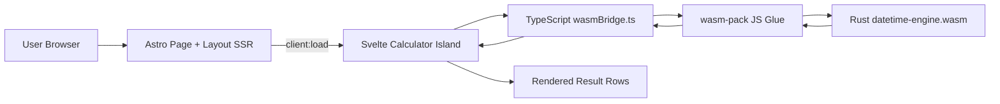
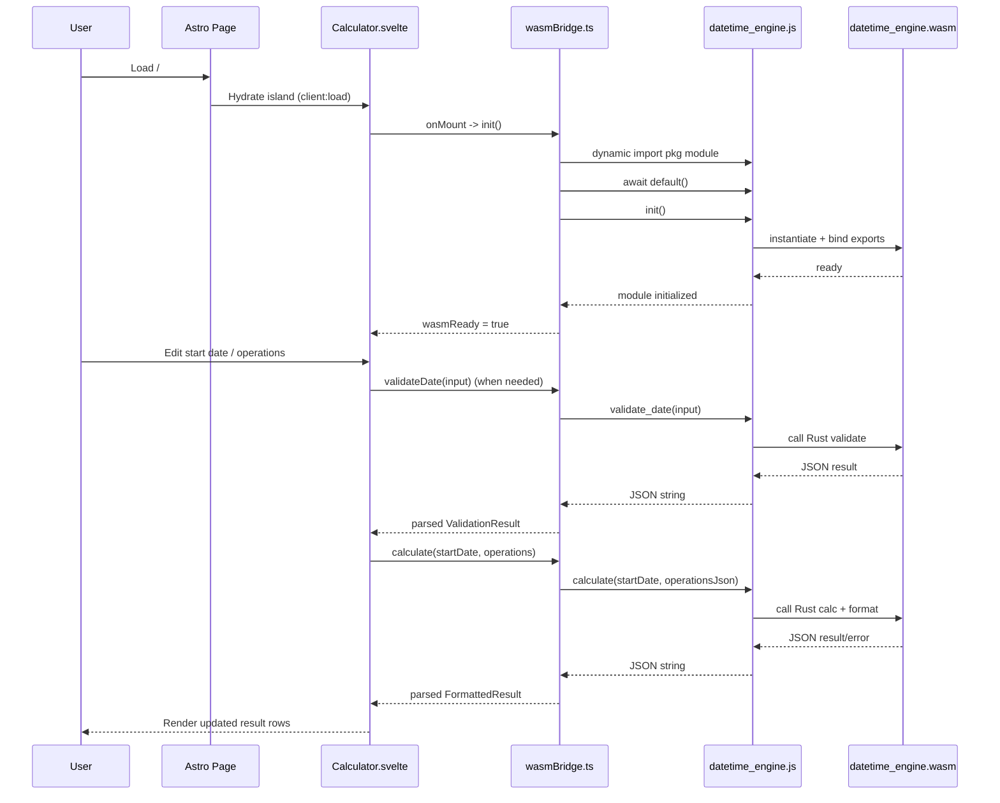

# datetime-helper Architecture

This document explains how `datetime-helper` is composed across Astro, Svelte, and Rust/WASM, and how data flows between those layers at runtime.

## High-Level Overview

The application is structured as three cooperating layers:

1. **Astro shell (SSR + routing + page chrome)**
2. **Svelte island (interactive calculator UI + state orchestration)**
3. **Rust/WASM engine (deterministic datetime compute + validation)**

Astro renders the page and hydrates a Svelte island. Svelte manages user input/state and calls a typed TypeScript bridge. The bridge calls into the Rust engine compiled to WebAssembly.

## Architecture Diagram

## Layer Responsibilities

### 1) Astro: Page Shell and Hydration Boundary

- Config enables Svelte integration (`astro.config.mjs`).
- Main page mounts the calculator component with `client:load` (`src/pages/index.astro`).
- Global layout, metadata, styling, and static HTML are rendered by Astro (`src/layouts/Layout.astro`, `src/layouts/DocsLayout.astro`).

**Key point:** Astro does not execute datetime calculations; it hosts and hydrates the interactive calculator island.

### 2) Svelte: Interaction and State Orchestration

- Main interactive component: `src/components/Calculator.svelte`.
- Handles:
  - User inputs (start date, operations, mode toggles)
  - Local/derived UI state
  - URL-state sync/share-link behavior
  - Feature orchestration (AI parsing, reverse decode, countdown, cron helper)
  - Error handling and hydration behavior

On mount, Svelte initializes the WASM engine via `init()` from `src/lib/wasmBridge.ts`, then computes results reactively as inputs change.

### 3) Rust/WASM: Compute Engine

- Rust crate: `crates/datetime-engine`.
- Exposed wasm-bindgen API (`crates/datetime-engine/src/lib.rs`):
  - `init()`
  - `calculate(start_date, operations_json)`
  - `validate_date(input)`
  - `now_unix()`
- Core modules:
  - `calc.rs`: parse input + apply date math operations
  - `format.rs`: produce Unix/ISO/RFC/human representations
  - `validate.rs`: input validation path
  - `json_utils.rs`: manual JSON escaping/serialization utilities

**Key point:** Rust/WASM owns canonical datetime arithmetic and validation logic.

## Integration Contract: TypeScript WASM Bridge

`src/lib/wasmBridge.ts` is the only module that directly touches generated wasm-pack output.

- Dynamically imports `../../crates/datetime-engine/pkg/datetime_engine.js`
- Initializes WASM (`await wasm.default(); wasm.init();`)
- Exposes typed wrappers:
  - `init()`
  - `calculate(startDate, operations)`
  - `validateDate(input)`
  - `nowUnix()`
- Translates TypeScript objects to JSON strings for WASM calls
- Parses JSON string responses back into TS types (`src/lib/types.ts`)

This isolates Wasm loading/boundary concerns from UI components.

## Runtime Data Flow

1. User requests `/`
2. Astro serves SSR page shell
3. Svelte `Calculator` hydrates (`client:load`)
4. `Calculator` calls `wasmBridge.init()`
5. Bridge loads wasm-pack JS + `.wasm` module
6. User updates input/operations
7. Svelte triggers recalculation:
   - validates/normalizes date input (WASM `validate_date`)
   - computes output (WASM `calculate`) for arithmetic operations
8. Result is rendered in Svelte result rows (Unix, ISO 8601, RFC 2822, human-readable)

## Initialization and Recalculation Sequence

## Feature-Specific Notes

- **Snap operations** (`startOfDay`, `endOfMonth`, etc.) are currently handled in TS (`src/lib/snapOperations.ts`) before final formatting through WASM.
- **Reverse decode mode** (`src/lib/reverseDecode.ts`) parses timestamps/ISO input in TS and returns `FormattedResult`-compatible output.
- **Timezone presentation context** (`src/lib/timezoneContext.ts`) can post-process display formatting in TS/Intl while preserving the same instant returned by the engine.

## Build and Packaging Relationship

- WASM artifacts are generated by:
  - `pnpm build:wasm` -> `wasm-pack build --target web` (inside `crates/datetime-engine`)
- Astro build is:
  - `pnpm build`

Because the app imports generated wasm-pack bindings from `crates/datetime-engine/pkg`, WASM build output must exist for app build/runtime paths that depend on it.

## Design Intent

- Keep datetime correctness logic centralized in Rust/WASM
- Keep UI and UX concerns in Svelte
- Keep rendering/routing and static shell in Astro
- Keep the Wasm boundary narrow and typed (`wasmBridge.ts`) for maintainability and testability
